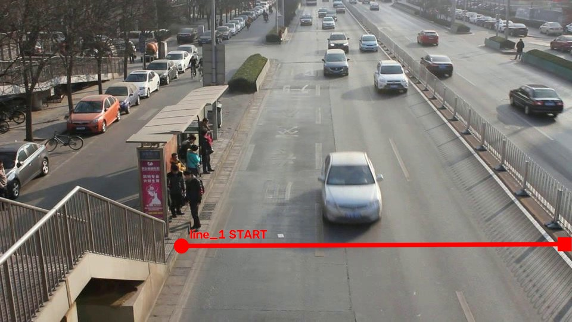

# dev_01_detrac_MVI_20011

Video: `960x540`, khoảng `26.56s`.
Mục tiêu: test single-line counting trên một luồng xe.

## Counting line(s) đã chốt

- `line_1`: `START=(304,412)`, `END=(947,409)`.
- Normalized: `START=(0.3167,0.7630)`, `END=(0.9865,0.7574)`.

## Counting rule

- Nhìn theo hướng `START -> END`, chỉ count xe crossing từ **phía trái** của line sang **phía phải**.
- Counting point: tâm bbox `(cx, cy)`.
- Crossing phải là giao giữa quỹ đạo tâm bbox và **đoạn START-END hữu hạn**.
- Mỗi physical vehicle chỉ count một lần.
- Không dùng hoặc lưu trường `direction` riêng.

## Manual/debug rule

- Xe đỗ, xe ngoài vùng đếm hoặc xe không crossing line thì không tính.
- Config tọa độ chuẩn nằm trong `data/ground_truth/line_configs/` theo tên video.
