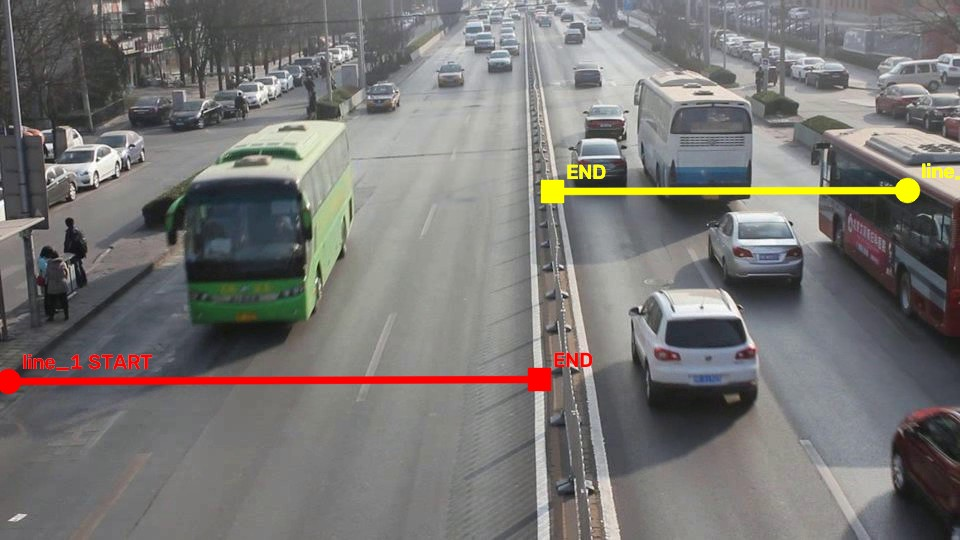

# dev_03_detrac_MVI_20034

Video: `960x540`, khoảng `32s`.
Mục tiêu: test multiple-line counting trên hai carriageway.

## Counting line(s) đã chốt

- `line_1`: `START=(8,381)`, `END=(539,379)`.
- Normalized: `START=(0.0083,0.7056)`, `END=(0.5615,0.7019)`.
- `line_2`: `START=(907,190)`, `END=(552,191)`.
- Normalized: `START=(0.9448,0.3519)`, `END=(0.5750,0.3537)`.

## Counting rule

- Nhìn theo hướng `START -> END`, chỉ count xe crossing từ **phía trái** của line sang **phía phải**.
- Counting point: tâm bbox `(cx, cy)`.
- Crossing phải là giao giữa quỹ đạo tâm bbox và **đoạn START-END hữu hạn**.
- Mỗi physical vehicle chỉ count một lần.
- Không dùng hoặc lưu trường `direction` riêng.

## Manual/debug rule

- Hai line có START/END riêng để cùng dùng một quy tắc trái -> phải tương đối.
- Không cho cùng một physical vehicle được count lại ở line khác.
- Xe đỗ, xe ngoài vùng đếm hoặc xe không crossing line thì không tính.
- Config tọa độ chuẩn nằm trong `data/ground_truth/line_configs/` theo tên video.
