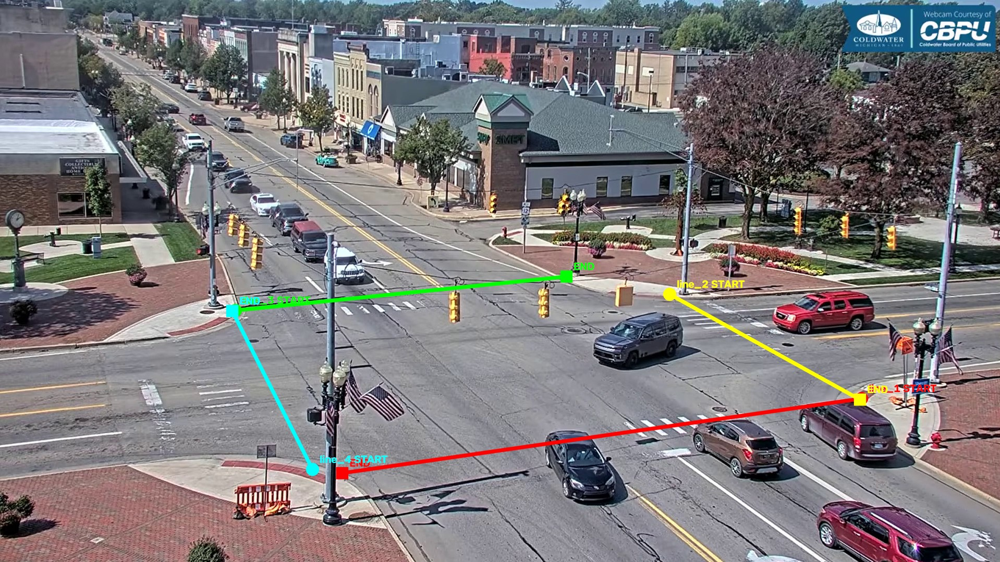

# dev_04_4_corners

Video: `1918x1078`, khoảng `33.90s`.
Mục tiêu: test multiple-line counting tại ngã tư.

## Counting line(s) đã chốt

- `line_1`: `START=(1652,764)`, `END=(656,907)`.
- Normalized: `START=(0.8613,0.7087)`, `END=(0.3420,0.8414)`.
- `line_2`: `START=(1284,564)`, `END=(1649,766)`.
- Normalized: `START=(0.6694,0.5232)`, `END=(0.8597,0.7106)`.
- `line_3`: `START=(451,595)`, `END=(1086,530)`.
- Normalized: `START=(0.2351,0.5519)`, `END=(0.5662,0.4917)`.
- `line_4`: `START=(599,900)`, `END=(445,596)`.
- Normalized: `START=(0.3123,0.8349)`, `END=(0.2320,0.5529)`.

## Counting rule

- Nhìn theo hướng `START -> END`, chỉ count xe crossing từ **phía trái** của line sang **phía phải**.
- Counting point: tâm bbox `(cx, cy)`.
- Crossing phải là giao giữa quỹ đạo tâm bbox và **đoạn START-END hữu hạn**.
- Mỗi physical vehicle chỉ count một lần.
- Không dùng hoặc lưu trường `direction` riêng.

## Manual/debug rule

- Dùng 4 entry line; xe rẽ vẫn chỉ count một lần tại entry line ban đầu.
- Không count lại khi xe đi ra và crossing line khác.
- Xe đỗ, xe ngoài vùng đếm hoặc xe không crossing line thì không tính.
- Config tọa độ chuẩn nằm trong `data/ground_truth/line_configs/` theo tên video.
