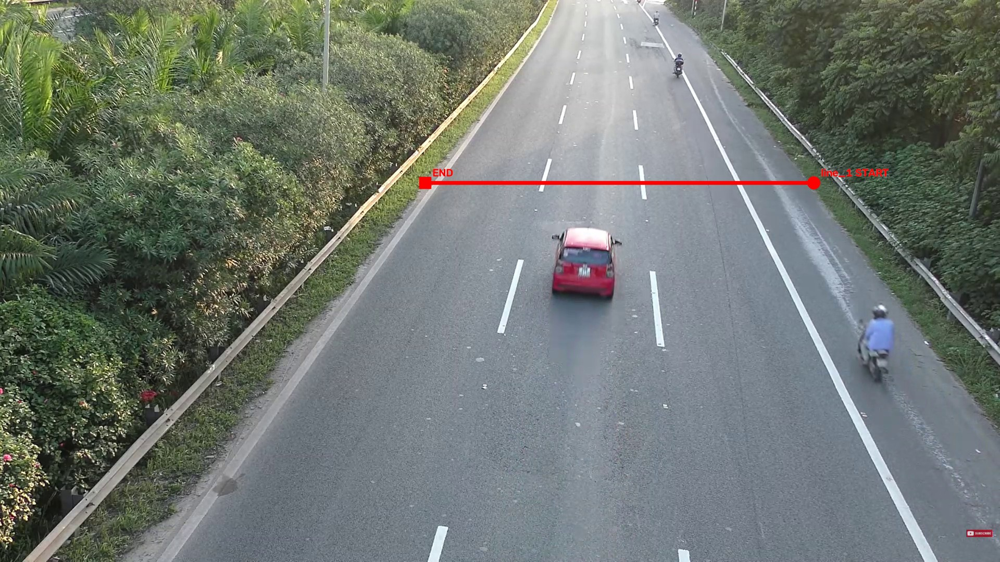

# dev_05_1_line

Video: `1920x1080`, khoảng `34.53s`.
Mục tiêu: test single-line counting trên luồng xe một chiều.

## Counting line(s) đã chốt

- `line_1`: `START=(1562,351)`, `END=(816,351)`.
- Normalized: `START=(0.8135,0.3250)`, `END=(0.4250,0.3250)`.

## Counting rule

- Nhìn theo hướng `START -> END`, chỉ count xe crossing từ **phía trái** của line sang **phía phải**.
- Counting point: tâm bbox `(cx, cy)`.
- Crossing phải là giao giữa quỹ đạo tâm bbox và **đoạn START-END hữu hạn**.
- Mỗi physical vehicle chỉ count một lần.
- Không dùng hoặc lưu trường `direction` riêng.

## Manual/debug rule

- START/END được đặt sao cho luồng xe hợp lệ vẫn tương ứng với quy tắc trái -> phải tương đối.
- Xe đỗ, xe ngoài vùng đếm hoặc xe không crossing line thì không tính.
- Config tọa độ chuẩn nằm trong `data/ground_truth/line_configs/` theo tên video.
