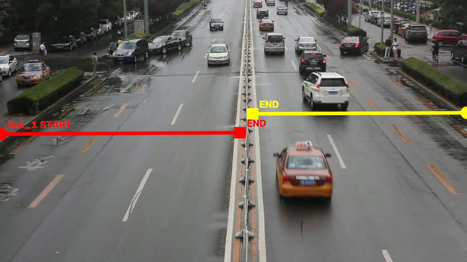

# eval_01_detrac_40131_40141

Video: `960x540`, khoảng `129.80s`, `25 FPS`.
Mục tiêu: evaluation trên đường hai chiều với hai counting line.

## Counting line(s) đã chốt

- `line_1`: `START=(2,276)`, `END=(493,273)`.
- `line_2`: `START=(959,232)`, `END=(519,234)`.
- Config máy đọc: `data/ground_truth/line_configs/eval_01_detrac_40131_40141_lines.json`.

## Counting rule

- Nhìn theo `START -> END`, chỉ count xe crossing từ phía trái sang phía phải.
- Counting point là tâm bbox `(cx, cy)` và phải cắt đoạn line hữu hạn.
- `line_1`, `line_2` chỉ là ID; hướng đếm nằm trong START/END.
- Ground Truth hiện tại không cần cột `direction` riêng.

## Manual Ground Truth

- Đã manual-count toàn bộ video theo interval `10s` và đã có bản tổng hợp theo phút.
- Tổng aggregate hiện tại: `105` xe.
- Files chính: `data/ground_truth/eval_01_detrac_40131_40141_manual_counts_by_10s.csv` và `*_by_minute.csv`.
