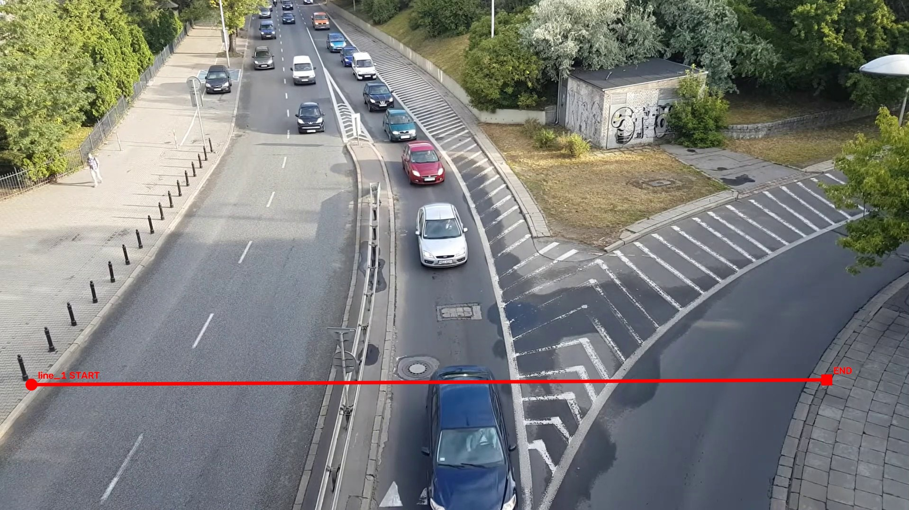

# eval_02

Video: `1918x1076`, khoảng `179.07s`, `30 FPS`.
Mục tiêu: evaluation trên nhiều luồng xe với một counting line.

## Counting line(s) đã chốt

- `line_1`: `START=(66,811)`, `END=(1744,801)`.
- Config máy đọc: `data/ground_truth/line_configs/eval_02_lines.json`.

## Counting rule

- Nhìn theo `START -> END`, chỉ count xe crossing từ phía trái sang phía phải.
- Counting point là tâm bbox `(cx, cy)` và phải cắt đoạn line hữu hạn.
- `line_1` chỉ là ID; hướng đếm nằm trong START/END.
- Ground Truth hiện tại không cần cột `direction` riêng.

## Manual Ground Truth

- Đã manual-count toàn bộ video theo interval `10s` và đã có bản tổng hợp theo phút.
- Tổng aggregate hiện tại: `199` xe.
- Files chính: `data/ground_truth/eval_02_manual_counts_by_10s.csv` và `eval_02_manual_counts_by_minute.csv`.
